# 1. Guide d'installation

## 1.1 Pré-requis

### - Pour commecer il est impératif de faire un fork du projet. **Si vous ne le faites pas vous ne respecterez pas les conditions d'utilisation.**

### - Il faut installer les logiciels suivants pour pouvoir commencer à editer le launcher :

- [Github Desktop](https://desktop.github.com/)
- [Visual Studio Code](https://code.visualstudio.com/)
- [Node.js](https://nodejs.org/) **⚠️ Prendre la version LTS**
- [Git](https://git-scm.com/)
- NPM (voir instructions plus tard)

### - Un Webserver sous apache et php fonctionnel ⚠️ **Obligatoire pour démarrer le launcher**

___
## 1.1.1 Le Fork

Pour commencer vous devez faire un fork du projet pour ce faire rendez vous [ici](https://github.com/luuxis/Selvania-Launcher).

- Ensuite cliquez sur "Fork" :


- Entrez les informations voulues et cliquez sur "Create fork" :

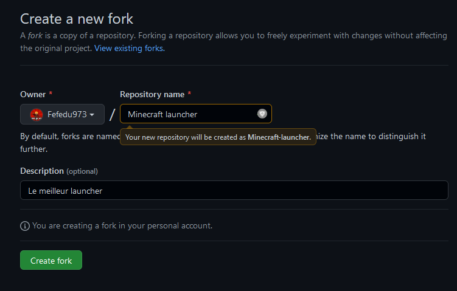

___
## 1.1.2 Faire un clone : 

- Cliquez sur "Code" puis "Open with Github Desktop" :

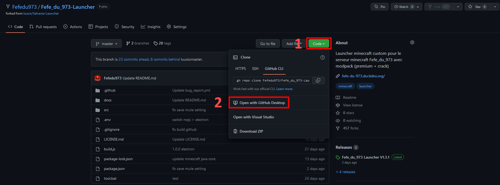


- L'application "Github Desktop" installé précédament va s'ouvrir, connectez vous à votre compte github

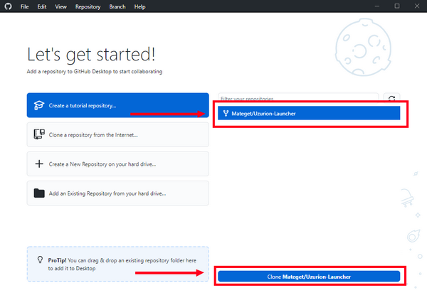

Choisissez bien l'endroit ou vous souhaitez placer le projet sur votre ordinateur.

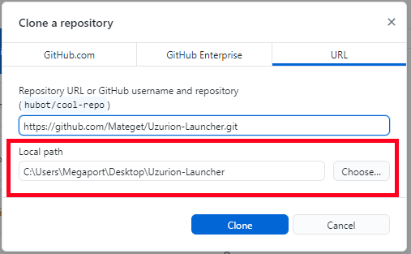
___
## Environnement

Pour compiler le projet il faut au moins avoir NodeJS, cependant il est conseillé aussi d'utiliser un éditeur de code pour éditer et compiler le projet plus facilement.<br>
Evidement si vous êtes déjà familiarisé avec ce genre d'environnement, libre à vous d'utiliser l'éditeur de votre choix, il n'y a que NodeJS qui est obligatoire.<br>
Voici des lien pour effectuer le téléchargement de ces applications :

 - [NodeJs](https://nodejs.org/fr/) (Version LTS de préférence)
 - [Visual Studio Code](https://code.visualstudio.com)

Si vous avez utilisé Github Desktop vous pouvez démarrer Visual Studio Code depuis ce dernier.

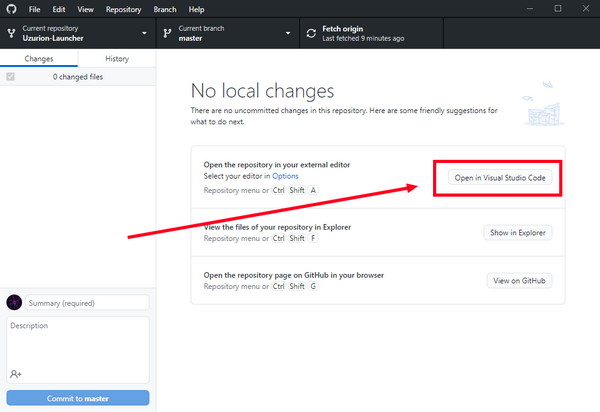

Sinon ouvrez directement depuis Visual Studio Code et choisissez le dossier ou vous avez enregistré le projet.

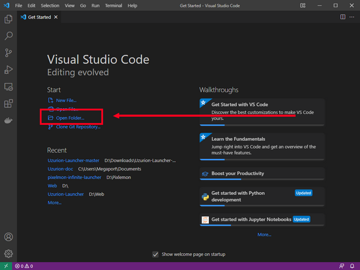

Il faut ensuite ouvrir un terminal depuis votre éditeur de code.

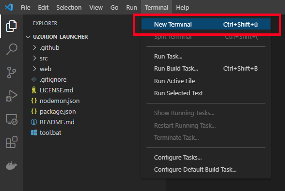

Une fois le terminal ouvert il faut installer les modules du projet :

```console
  npm install
```

Voici les commandes disponibles :

```console
  npm run build:win         // Compiler en version windows
  npm run build:mac         // Compiler en version mac
  npm run build:linux       // Compiler en version linux
  npm run build:all         // Compiler dans toutes les version 
  npm run clean             // Néttoyer 
  npm run dev               // Démarrer la version de développement 
```
___
## Configurer le launcher

Pour configurer le launcher il faut posséder un serveur web, il peut être local ou distant. A noter que si il est local le téléchargement de la configuration du launcher et de ses fichiers, ne fonctionnera que depuis votre ordinateur en local. Il est donc préférable de le faire sur un serveur distant.

Pré-requis du serveur distant ou local:
 - Apache, Nginx ou équivalent
 - PHP

Si vous n'avez pas ces pré-requis vous pouvez consulter les informations pour leurs installation [ici](./server_web_php.md).

Nous considérons que vous avez une installation Web/PHP fonctionnel pour la suite.

Une partie des fichiers téléchargés doivent être placé sur votre serveur web pour être utilisé, ils serons récupérer par le launcher lorsque il est démarré.

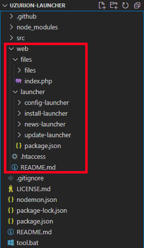

Depuis le fichier situé dans le dossier web/launcher/config-launcher/config.json vous allez pouvoir gérer plusieurs paramètres du launcher.

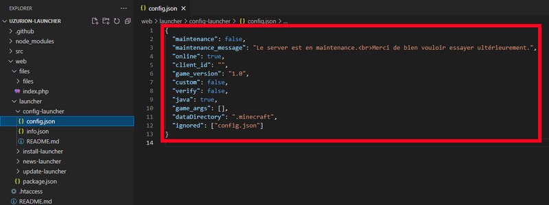

 - maintenant : permet de définir sur le launcher est en maintenance ou non
 - maintenance_message : permet de définir le message affiché aux utilisateur du launcher lorsque il est en maintenant
 - online : permet de définir si le launcher est en crack ou non
 - client_id : le client id du microsoft account
 - game_version : la version de minecraft que le launcher dois utiliser
 - custom : indique si le launcher dois télécharger des ressources sur le serveur web, à mettre sur true dans le cas d'un moddé par exemple
 - verify : indique au launcher si il dois vérifier si aucun fichier n'a été ajouté aux fichiers du launcher (pseudo anti-cheat)
 - java : indique si le launcher dois télécharger java depuis les serveurs de mojang, utile pour s'assurer que les utilisateurs du launcher ont un java compatible
 - dataDirectory : indique au launcher le no du dossier ou les fichiers doivent êtres téléchargés
 - ignored : la white-list des fichiers à ne pas controller par l'option verify

[Comment ajouter Forge aux launcher](./forge.md)

Depuis le fichier situé dans le dossier web/launcher/config-launcher/info.json vous allez pouvoir gérer l'IP et port de votre sevreur pour permettre au launcher d'aller récupérer le nombre de joueurs connecté, si il est allumé, etc.

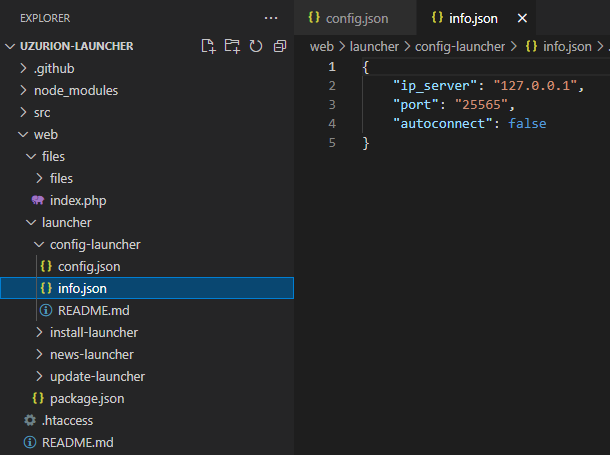

Une fois la configuration côté serveur web faite, il faut configurer le launcher pour indiquer l'URL où aller chercher les fichiers sur serveur web. Vous pouvez aussi modifier le nom du launcher si vous le souhaitez depuis ce fichier.

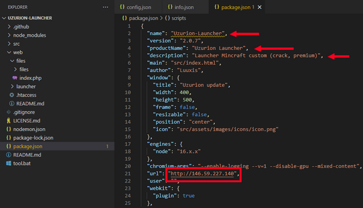

Assurez vous depuis votre navigateur de vérifier que l'URL saisie fonctionne bien et que vous avez un affichage similaire à l'image suivante :


___
## Execution du launcher en local

Arrivée à cette étape, vous devrez pourvoir executer le launcher en local pour vérifier que votre installation fonctionne.<br>
Depuis un terminal vous pouvez taper la commande suivante :
```console
npm run dev
```

Les fichiers de lancement vont être téléchargé avant le launcement du launcher.

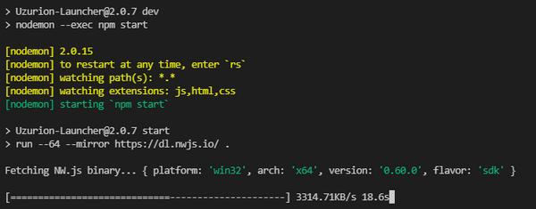

Si vous souhaiter modifier le launcher, changer les images, les textes, etc vous devrez le faire depuis les fichiers suivants :

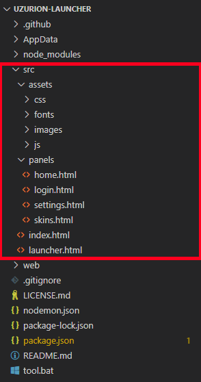

A noter que le launcher est une application web donc il faut avoir quelques bases en HTML/CSS pour modifier l'apparence et texte, et avoir des baes en Javascript pour modifier les fonctionnalitées.

___
## Compilation du launcher en version à télécharger

Une fois que vous avez fait la customisation local du launcher que vous souhaitez vous allez devoir compiler le projet en un fichier executable. Ce fichier permettras aux utilisateurs de télécharger votre launcher et de l'installer facilement.<br>
Commande pour compiler le launcher :

```console
  npm run build:win         // Compiler en version windows
  npm run build:mac         // Compiler en version mac
  npm run build:linux       // Compiler en version linux
  npm run build:all         // Compiler dans toutes les version 
```
Taper la commande de votre choix, une fois terminé un nouveau dossier avec les fichiers permettant l'instalation du launcher auras été créé : 

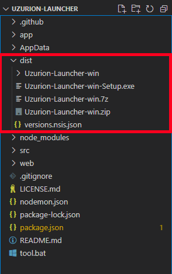

Ce sont les fichiers à partager en fonction de vos préférences, il y a plusieurs version, .rar .zip en archives ou .exe sous forme de setup. Il ne reste plus qu'a mettre disponible en téléchargement ces fichiers.

___

Si vous avez besoin d'aide ne pas hésiter pas à rejoindre le discord pour demander conseil.
[<p align="center">](https://discord.gg/e9q7Yr2cuQ) 
